# Oi, eu sou o Pedro Ramos 🧑🏻‍💻🧾🎲

Tenho 29 anos e sou natural de Olinda/PE.

Sou Bacharel em Ciências Contábeis pela UNIBRA e estudante de Ciência de Dados pela Cruzeiro do Sul. Atualmente, faço parte da Deloitte, integrando um dos times do financeiro, atuando com contas a pagar e outras atividades relacionadas ao setor.

Sou apaixonado pelo que faço, pela minha formação e pelo caminho que estou construindo. Um desejo antigo de estudar tecnologia me trouxe até aqui e despertou em mim o interesse em unir minha experiência em **Finanças e Contabilidade** com a área de **Dados**.

Por isso, iniciei meus estudos em Ciência de Dados, buscando desenvolver conhecimentos em **SQL, Python, Power BI, Excel e análise de dados**, conectando minha experiência profissional ao universo da tecnologia.

Aqui compartilho parte do meu aprendizado, projetos e conhecimentos adquiridos ao longo dessa jornada.

Você também pode acompanhar essa evolução pelos meus outros canais: **[aqui](https://linktr.ee/ppedropeu)**.

---

## 🧑🏻‍💻 Tecnologias e ferramentas

### 📊 Dados & Business Intelligence

 
 

### 🛠️ Desenvolvimento & Versionamento

 
 

---

## 📚 Atualmente estudando

* 🐍 **Python** para análise e tratamento de dados
* 🗄️ **SQL** para consultas, manipulação e análise de dados
* 📊 **Power BI** para Business Intelligence e visualização de dados
* 📈 **Excel** para análise e tratamento de informações
* 🧠 **Ciência de Dados** e fundamentos de análise de dados
* 🔄 **Git e GitHub** para versionamento e organização de projetos

---

## 📊 Estatísticas do GitHub

 
 
 
 

---

## 🚀 Projetos

### 📊 Power BI

Projetos desenvolvidos para praticar **Business Intelligence, tratamento de dados, criação de indicadores e desenvolvimento de dashboards**.

### 🗄️ SQL

Exercícios e projetos voltados para **consultas, filtros, agregações, relacionamentos, análise e manipulação de dados**.

### 🐍 Python

Projetos desenvolvidos durante minha jornada de estudos em **Python e análise de dados**.

---

## 🎯 Objetivo

Construir uma carreira na área de **Dados**, unindo minha experiência em **Finanças e Contabilidade** ao conhecimento técnico em **SQL, Python, Power BI e Ciência de Dados**.

---

📫 **Vamos nos conectar?**

**[LinkedIn](https://www.linkedin.com/)** • **[Linktree](https://linktr.ee/ppedropeu)**
